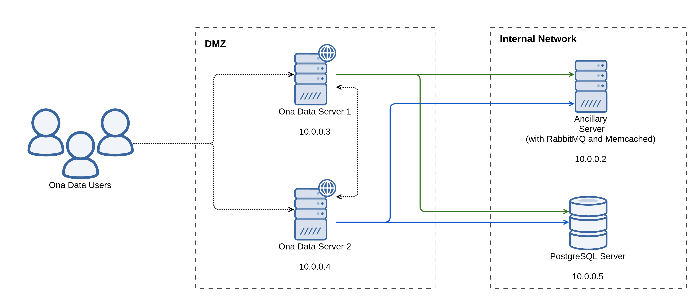

## Ona Data Load Balanced Setup

This example demonstrates how to install Ona Data on two load balanced servers that share a PostgreSQL and ancillary host (with RabbitMQ and Memcached). The diagram below shows the architecture of the setup.



This directory contains Ansible playbooks to deploy services against four Ubuntu 18.04 VirtualBox virtual machines (also set up using files here). Make sure you have Ansible (version 2.8 and up), Vagrant, and VirtualBox installed on the machine you will be testing out the deployment. The machine should have 10 GB of free memory for the setup to run flawlessly. If you don't have that amount of free memory, try amend the allocated memory for the vagrant machines [here](./vagrant/hosts).

### Installed Services

Here's a list of services that are installed on each of the hosts:

```
1. 192.168.56.2
  a. RabbitMQ
  b. Memcached
  c. Monit
  d. collectd
2. 192.168.56.3 and 192.168.56.4
  a. Ona Data
  b. NGINX
  c. Monit
  d. PgBouncer
  e. collectd
  f. Logstash
3. 192.168.56.5
  a. PostgreSQL
  b. Monit
  c. collectd
4. 192.168.56.6 (optional)
  a. Samba
  b. collectd
```

### Running the Example

The instructions here assume you are running this example setup on a Linux or MacOS machine. You should technically also be able to use the Windows [bash shell](https://www.howtogeek.com/249966/how-to-install-and-use-the-linux-bash-shell-on-windows-10/). Alternative instructions are provided for those not able to run the custom bash scripts herein.

You will first need to bring up the VirtualBox virtual machines using Vagrant. Do this by running:

```sh
./bring-up.sh
```

> Note: if you are unable to run the above script, run `vagrant up` whilst in [this](./vagrant) directory.

After the virtual machines have been successfully brought up, install the Ansible role requirements by running:

```sh
ansible-galaxy install -r requirements.yml -p roles
```

The above command will download a list of Ansible roles needed to set up the services.

You can now run Ansible against the virtual machines to install all the services. Run:

```sh
ansible-playbook -i inventory deploy-everything.yml
```

The `deploy-everything.yml` playbook will run the following playbooks:
1. initial-setup.yml
1. samba.yml
1. postgresql.yml
1. rabbitmq.yml
1. memcached.yml
1. onadata.yml

The `onadata.yml` playbook will set up both Ona Data, NGINX, and Monit in the Ona Data servers.

Once the `deploy-everything.yml` playbook is done running, you can hit either of the Ona Data virtual machines (192.168.56.3 and 192.168.56.4) to access the service. NGINX will handle load balancing the traffic between the hosts.

To hit 192.168.56.3 using cURL, run:

```sh
curl --insecure --header 'Host: example.com' https://192.168.56.3
```

We provide the `--insecure` flag since this example deployment uses a self-signed SSL certificate. In your actual deployment, please don't use a self-signed SSL certificate (unless you really have to).

To access Ona Data on a browser, you will need to set example.com to resolve to either 192.168.56.3 or 192.168.56.4. On MacOS and Linux, set example.com to resolve to 192.168.56.4 by adding the following line to your `/etc/hosts` file:

```ini
192.168.56.4        example.com
```

For Windows, follow [these](https://www.howtogeek.com/howto/27350/beginner-geek-how-to-edit-your-hosts-file/) instructions.

You might need to authorize the browser to connect to the "insecure" domain (since the SSL certificate being used is self-signed).

After you're done testing, tear down the virtual machines that have been brought up by running:

```sh
./tear-down.sh
```

> Note: if you are unable to run the above script, run `vagrant destroy` whilst in [this](./vagrant) directory.

### Using the Files for Your Deployment

We understand that you might want to use these deployment files elsewhere (for a production setup, for instance). The following are considerations you should make when using these scripts elsewhere:

#### 1. Files to Ignore

You might not need the following files/directories:

1. [vagrant](./vagrant): Contains the Vagrantfile that brings up the virtual machines used in this example.
1. [bring-up.sh](./bring-up.sh) and [tear-down.sh](./tear-down.sh): Wrapper scripts around Vagrant.
1. [files/gpg/F73D9AE7](./files/gpg/F73D9AE7): GPG keypair used in this example. We highly recommend that you create your own GPG keypair for encrypting the database backups. Check the section below for instructions on how to do this.
1. [files/ssl/example.com](./files/ssl/example.com): Self-signed certificate for this example. Use SSL certificates for your domain.
1. [files/ssl/postgresql](./files/ssl/postgresql): These are publicly available and shouldn't be considered secure. Generate your own set of keys.

#### 2. Generating a GPG Keypair

You will need to generate a GPG keypair used to encrypt and decrypt database backups. The deployment scripts set up [duply](https://www.duply.net/) for encrypted database backups.

It's highly recommended to create your keypair inside a fresh Docker container. Bring up a container and install gnupg in it by running:

```sh
docker pull ubuntu:18.04
docker run -it --name onadata-gpg ubuntu:18.04 /bin/bash
apt update
apt install gnupg
```

Create an RSA GPG keypair by running:
```sh
gpg --full-generate-key
```

> Note: The deployment scripts here don't yet using GPG keys with passphrases. Create a keypair that doesn't have a passphrase.

You will need to then get the key ID for the keypair generated. Do this by running:

```sh
gpg --list-secret-keys --keyid-format SHORT
```

Look out for the line starting with `sec   rsa`. Copy over the eight character string after `/`. That's the key ID.

Export the keypair and trust, by running:

```sh
gpg --export-secret-keys --armor > /tmp/priv.asc
gpg --export --armor <key ID> > /tmp/pub.asc
gpg --export-ownertrust > /tmp/ultimate.trust
```

While the container is still running, in another terminal window, copy over the exported files into this directory by running:

```sh
mkdir -p files/gpg/<key ID>
docker cp onadata-gpg:/tmp/priv.asc files/gpg/<key ID>/priv.asc
docker cp onadata-gpg:/tmp/pub.asc files/gpg/<key ID>/pub.asc
docker cp onadata-gpg:/tmp/ultimate.trust files/gpg/<key ID>/ultimate.trust
```

You will also need to modify [inventory/group_vars/postgresql/vars.yml](./inventory/group_vars/postgresql/vars.yml) and modify the keypair to be installed in the PostgreSQL host. Change the value of `postgresql_backup_gpg_key_id` in that file to your keypair ID.

#### 3. SSL Certificates

We recommend that you use SSL certificates for the domain you want to set up, and not the ones in this directory. You will need to combine the certificate and chain files into one file (called the fullchain):

```sh
cat <certificate file> > fullchain.pem
cat <chain file> >> fullchain.pem
```

Move the key and fullchain files into `files/ssl/<your domain>/key.pem` and `files/ssl/<your domain>/fullchain.pem` respectively.

Please remember to also update the `onadata_domain` variable in [inventory/group_vars/onadata/vars.yml](./inventory/group_vars/onadata/vars.yml) to your domain name.

#### 4. Network Storage

For the load balanced setup to work as expected, the two Ona Data servers will need to share form attachments, exports, and submission media (all written to the directory specified in the `onadata_media_path` variable inside the [inventory/group_vars/onadata/vars.yml](./inventory/group_vars/onadata/vars.yml) file).

We, therefore, recommend mounting the same network storage as that directory on both servers. Please make sure the `onadata` (or whatever `onadata_system_user` is set to) system user has read and write permissions on this mount point.

In this example, the PostgreSQL backups are written to the `/var/lib/postgresql/backups` directory in the PostgreSQL host. If you choose to still write the backups to the filesystem, we recommend that you mount network storage as the `/var/lib/postgresql/backups` directory (or whatever `postgresql_backup_target_path` is set to).

Both the Ona Data media and PostgreSQL backup directories in this example are mount points for Samba shares in the Samba server. It is not a requirement that you have to use Samba for file sharing, and just for demonstration purposes. This also means that you DO NOT have to deploy the Samba server if you have network storage available. You will, however, have to specify the correct mount point options in the onadata and postgres group_vars. Refer to section on variables to change below.

If you do not intend on installing Samba for network attached storage, make sure to make the following changes to your inventory:
 1. Delete [inventory/group_vars/samba](./inventory/group_vars/samba)
 1. Delete [inventory/host_vars/samba-host](./inventory/host_vars/samba-host)
 1. Remove all mentions of the samba group_var and samba-host host_var in [inventory/hosts](./inventory/hosts)

#### 5. DNS Record

This setup should work if your DNS record for the Ona Data service points to either or both of the Ona Data hosts. NGINX will handle load balancing the traffic between the hosts.

#### 6. TLS for PostgreSQL

We recommend that you encrypt traffic between your application servers and the database server. Please DO NOT use the certificate and key file in this repository. To do this, you will need to generate a TLS key and certificate for the PostgreSQL server. The certificate ought to be signed by a Certificate Authority (CA), also created by you, for the clients to also authenticate the identity of the server.

To generate a CA key and certificate, run:

```sh
openssl req -new -nodes -text -out root.csr \
  -keyout root.key -subj "/CN=root.<your domain>"
openssl x509 -req -in root.csr -text -days 3650 \
  -extfile /etc/ssl/openssl.cnf -extensions v3_ca \
  -signkey root.key -out root.crt
```

Make sure to place the certificate and key file in a directory the [*onaio.postgresql*](https://github.com/onaio/ansible-postgresql) and [*onaio.pgbouncer*](https://github.com/onaio/ansible-pgbouncer) roles can access them. The [*onaio.ssl-certificate*](https://github.com/onaio/ansible-ssl-certificate) role (through the PostgreSQL role) will generate the server key and certificate for you, and sign the certificate using the CA key:

```sh
mv root.crt files/ssl/postgresql/
mv root.key files/ssl/postgresql/
rm root.csr
```

#### 7. Backups

This example setup uses Duply (a wrapper around [Duplicity](http://duplicity.nongnu.org/)) to handle the encrypted full and incremental PostgreSQL backups. The Duply profile for the Ona Data database backup is configured to be run using the PostgreSQL user. To manually create a backup run the following commands while inside the PostgreSQL server:

```sh
sudo su - postgres
duply onadata backup
```

If the backup is successful, the command will output the statistics for the backup (Take note of the `Errors` statistic):

```
--------------[ Backup Statistics ]--------------
StartTime 1593701022.77 (Thu Jul  2 14:43:42 2020)
EndTime 1593701022.79 (Thu Jul  2 14:43:42 2020)
ElapsedTime 0.02 (0.02 seconds)
SourceFiles 1
SourceFileSize 270868 (265 KB)
NewFiles 0
NewFileSize 0 (0 bytes)
DeletedFiles 0
ChangedFiles 1
ChangedFileSize 270868 (265 KB)
ChangedDeltaSize 0 (0 bytes)
DeltaEntries 1
RawDeltaSize 269396 (263 KB)
TotalDestinationSizeChange 31073 (30.3 KB)
Errors 0
-------------------------------------------------

--- Finished state OK at 14:43:42.871 - Runtime 00:00:00.280 ---

--- Start running command POST at 14:43:42.883 ---
Running '/etc/duply/onadata/post' - OK
--- Finished state OK at 14:43:42.906 - Runtime 00:00:00.022 ---
```

Depending on what the status of the last backup is, Duply might run either a full or incremental backup. Incremental backup files contain just the diff of the state of the database dump after the last full backup. If you prefer to manually perform a full backup, run:

```sh
sudo su - postgres
duply onadata full
```

Otherwise, Duply has been configured to perform a full backup weekly, and one incremental backup every day (at 1AM server time) after, for six days. Duply has been configured to maintain a maximum of four full backups. Backups are also kept for a maximum of thirty days. Update the `postgresql_backup_profiles` variable in [inventory/group_vars/postgresql/vars.yml](./inventory/group_vars/postgresql/vars.yml) if you'd want to change any of the above settings.

To get the list of full and incremental backups, run:

```sh
sudo su - postgres
duply onadata status
```

If the status command runs successfully, it should output statistics like below:

```
Found 0 secondary backup chains.

Found primary backup chain with matching signature chain:
-------------------------
Chain start time: Thu Jul  2 12:53:39 2020
Chain end time: Thu Jul  2 14:54:37 2020
Number of contained backup sets: 4
Total number of contained volumes: 4
 Type of backup set:                            Time:      Num volumes:
                Full         Thu Jul  2 12:53:39 2020                 1
         Incremental         Thu Jul  2 14:43:42 2020                 1
         Incremental         Thu Jul  2 14:54:32 2020                 1
         Incremental         Thu Jul  2 14:54:37 2020                 1
-------------------------
No orphaned or incomplete backup sets found.
--- Finished state OK at 14:54:47.327 - Runtime 00:00:00.164 ---
```

To restore the last backup (irregardless of whether it is a full or incremental backup), run:

```sh
sudo su - postgres
duply onadata restore <path to file to place the database dump> 
```

Duply also allows you to restore a backup from a specific time. You can do this by adding the age of the backup to restore after the database dump path in the restore command above. Run `duply usage` for supported age formats.

You can configure to receive notifications for when backups are either successful or fail. Do this using the `postgresql_backup_post_actions` variable. The variable accepts a list of dicts that configure either email or command actions. You can, for instance, add to it an item that makes Duply (the tool we use for backups) run the echo command if a backup fails. You can do the same with emails. For each of the items in the list you are allowed to leave out either the `on_error` or `on_success` dicts if you don't want an action done when a backup fails or is successful respectively. The example values below configure Duply to echo "Backup has failed" and send out an email when the backups either run successfully (email subject set to "Ona Data Backup Successful") or fail (email subject set to "Ona Data Backup Failed"):

```yml
postgresql_backup_post_actions:
  - type: command
    on_error:
      command: "echo 'Backup has failed'"
  - type: email
    name: ona
    to: "admin@example.com"
    from: "monitoring@example.com"
    smtp:
      port: 587
      host: smtp.example.com
      user: admin
      password: admin
      use_startls: true
    on_error:
      subject: "Ona Data Backup Failed"
      message: "The last Ona Data database (in host 192.168.56.5) backup failed."
    on_success:
      subject: "Ona Data Backup Successful"
      message: "The last Ona Data database (in host 192.168.56.5) backup was successful."
```

#### 8. Variables to Change

Consider changing the following variables:

In [inventory/group_vars/all/vars.yml](./inventory/group_vars/all/vars.yml):

```yml
example_postgresql_host: "192.168.56.5" # Set to IP address of your PostgreSQL host
example_ancillary_host: "192.168.56.2" # Set to IP address of your ancillary host
example_api_host_0: "192.168.56.3" # Set to IP address of your first Ona Data host
example_api_host_1: "192.168.56.4" # Set to IP address of your second Ona Data host
example_samba_ssh_host: "192.168.56.6" # Set to the IP address of your Samba host

example_postgresql_ssh_host: "{{ example_postgresql_host }}"  # Change to Public IP of PostgreSQL host if not on the same subnet.
example_ancillary_ssh_host: "{{ example_ancillary_host }}"  # Change to Public IP of ancillary host if not on the same subnet.
example_api_ssh_host_0: "{{ example_api_host_0 }}"  # Change to Public IP of first Ona Data host if not on the same subnet.
example_api_ssh_host_1: "{{ example_api_host_1 }}"  # Change to Public IP of second Ona Data host if not on the same subnet.

set_hostname: true # Set to false if you don't want to set hostname

install_collectd: true # Set to false if you don't want to install collectd
collectd_graphite_server_ip: "127.0.0.1" # Set this to the Graphite host you want to forward collectd stats to
collectd_graphite_server_port: 2003 # Set this to the Graphite port to forward stats to
collectd_graphite_server_protocol: "tcp" # Set this to the protocol to use to forward Graphite stats
collectd_server_type: "production" # Set this to the environment to tag stats from the hosts
collectd_server_owner: "data-team" # Set this to the name of the owner for the server

postgresql_onadata_password: "somesecret" # Change to a stronger passphrase

rabbitmq_admin_password: "somesecret" # Change to a stronger passphrase

monit_email_admins: [{"Admin", "admin@example.com"}] # Email addresses to be alerted by Monit
no_reply_monit_email: "no-reply@example.com" # The email address Monit should send emails as
monit_smtp_server: "127.0.0.1" # Configured SMTP server for email notifications
monit_smtp_port: "25" # Configured SMTP port for email notifications
monit_smtp_username: "root" # Configured SMTP user for email notifications
monit_smtp_password: "" # Configured SMTP user password for email notifications
slack_monit_endpoint: "" # The slack webhook to send notifications to

samba_onadata_user: "onadata" # Set to the Samba users you would want to use for Ona Data's media share
samba_onadata_password: "somesecret" # Set to the password you would want to use for Ona Data's media share
samba_onadata_share: "media" # Set to the Samba share you would want to use for Ona Data's media
samba_backups_user: "backups" # Set to the Samba users you would want to use for the backups share
samba_backups_password: "somesecret" # Set to the password you would want to use for the backups share
samba_backups_share: "backups" # Set to the Samba share you would want to use for backups
```

In [inventory/group_vars/onadata/vars.yml](./inventory/group_vars/onadata/vars.yml):

```yml
onadata_django_secret_key: "somesecret" # Change to a stronger passphrase
# Change to the version of Ona Data you want to install. Check https://github.com/onaio/onadata/releases
onadata_version: "v2.0.11"
onadata_domain: "example.com" # Change to your Ona Data domain
onadata_email_admins: # Update to your admins
  - name: "Ona Data"
    email: "admin@example.com"
onadata_support_email: "support@example.com" # Update to your support email address
onadata_media_path: "{{ cifs_mount_path }}/{{ samba_onadata_share }}" # Update to the right path, depending on how you mount the media storage

# Onadata SMTP
onadata_smtp_host: # Set SMTP host to be used by Ona Data to send emails
onadata_smtp_port: # Set SMTP port to be used by Ona Data to send emails
onadata_smtp_login: # Set SMTP user to be used by Ona Data to send emails
onadata_smtp_password: # Set SMTP password to be used by Ona Data to send emails
onadata_smtp_use_tls: "True" # Whether Ona Data should connect to the SMTP server using TLS
onadata_smtp_from: "noreply@example.com" # The email address Ona Data should send emails as

# Media Mount Point
cifs_mount_share: "//{{ example_samba_ssh_host }}" # Set to the domain name or IP address of the network attached storage device
cifs_mount_user: "{{ samba_onadata_user }}" # Set to the user to authenticate as on the network attached storage
cifs_mount_password: "{{ samba_onadata_password }}" # Set to the password to authenticate using on the network attached storage
cifs_mount_options: "uid=onadata,gid=onadata,username={{ cifs_mount_user }},password={{ cifs_mount_password }}" # Set to the right mount options to use with the network attached storage (depends on the protocol being used)
cifs_mounts:
  - "{{ samba_onadata_share }}" # Update to the path within the network attached storage to mount as Ona Data's media store

# Remove the email and email_smtp items if you don't want to configure email
# notifications
# Remove the email_smtp item if you don't need to configure SMPT to send emails
# from the host
monit_scripts:
  - email
  - email_smtp
  - monit
  - celeryd-ona
  - nginx
  - openssh-server
  - rsyslog
  - system
  - uwsgi
# The maximum amount of memory in megabytes the Ona Data service should use before
# being restarted by Monit
uwsgi_total_memory_limit: 3072

install_logstash: true # Set to false if you don't want to install Logstash
logstash_gelf_server: 127.0.0.1 # The Gelf server to forward NGINX logs to
logstash_gelf_port: 12210 # The Gelf port to forward NGINX logs to
```
In [inventory/group_vars/postgresql/vars.yml](./inventory/group_vars/postgresql/vars.yml):

```yml
# Update to your database server's hostname or whatever domain name you are
# using to connect to it
postgresql_ssl_domain: "ansible-onadata-lb-postgres"

postgresql_backup_gpg_key_id: "F73D9AE7" # Update to your GPG keypair ID. Check previous section on how to do that
postgresql_backup_gpg_pass: "" # Update to the passphrase you gave your GPG private key, if you did
# Update with a list of actions you want done when backups either fail or are successful
# Check section on backups above for details of how to do this
postgresql_backup_post_actions: []

# Backup Mount Point
cifs_mount_share: "//{{ example_samba_ssh_host }}" # Set to the domain name or IP address of the network attached storage device
cifs_mount_user: "{{ samba_onadata_user }}" # Set to the user to authenticate as on the network attached storage
cifs_mount_password: "{{ samba_onadata_password }}" # Set to the password to authenticate using on the network attached storage
cifs_mount_options: "uid=postgres,gid=postgres,username={{ cifs_mount_user }},password={{ cifs_mount_password }}" # Set to the right mount options to use with the network attached storage (depends on the protocol being used)
cifs_mounts:
  - "{{ samba_onadata_share }}" # Update to the path within the network attached storage to mount as the backup store

# Remove the email and email_smtp items if you don't want to configure email
# notifications
# Remove the email_smtp item if you don't need to configure SMPT to send emails
# from the host
monit_scripts:
  - email
  - email_smtp
  - monit
  - openssh-server
  - rsyslog
  - system
  - postgres
```

In [inventory/host_vars/ancillary-host/vars.yml](./inventory/host_vars/ancillary-host/vars.yml):

```yml
# Remove the email and email_smtp items if you don't want to configure email
# notifications
# Remove the email_smtp item if you don't need to configure SMPT to send emails
# from the host
monit_scripts:
  - email
  - email_smtp
  - monit
  - memcached
  - openssh-server
  - rsyslog
  - system
  - rabbitmq
```

For the secret Ansible variables, consider using [Ansible Vault](https://docs.ansible.com/ansible/latest/user_guide/vault.html).

#### 9. Network Placement

It's recommended that you place the ancillary and PostgreSQL hosts in your internal network. None of the services deployed in both of those servers need to be accessed from the internet.

You can place the Ona Data hosts in your DMZ (network zone that's accessible from the internet).
