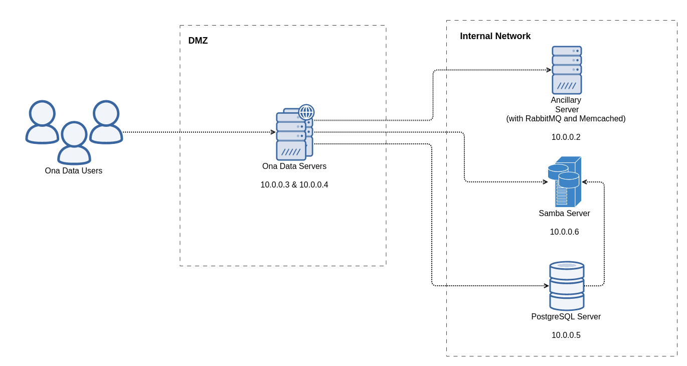

## Ona Data Load Balanced Setup

This example demonstrates how to install Ona Data on two load balanced servers that share a PostgreSQL and ancillary host (with RabbitMQ and Memcached). The diagram below shows the architecture of the setup.



This directory contains Ansible playbooks to deploy services against four Ubuntu 18.04 VirtualBox virtual machines (also set up using files here). Make sure you have Ansible (version 2.8 and up), Vagrant, and VirtualBox installed on the machine you will be testing out the deployment. The machine should have 10 GB of free memory for the setup to run flawlessly. If you don't have that amount of free memory, try amend the allocated memory for the vagrant machines [here](./vagrant/hosts).

### Installed Services

Here's a list of services that are installed on each of the hosts:

```
1. 10.0.0.2
  a. RabbitMQ
  b. Memcached
  c. Monit
2. 10.0.0.3 and 10.0.0.4
  a. Ona Data
  b. NGINX
  c. Monit
3. 10.0.0.5
  a. PostgreSQL
  b. Monit
```

### Running the Example

The instructions here assume you are running this example setup on a Linux or MacOS machine. You should technically also be able to use the Windows [bash shell](https://www.howtogeek.com/249966/how-to-install-and-use-the-linux-bash-shell-on-windows-10/). Alternative instructions are provided for those not able to run the custom bash scripts herein.

You will first need to bring up the VirtualBox virtual machines using Vagrant. Do this by running:

```sh
./bring-up.sh
```

> Note: if you are unable to run the above script, run `vagrant up` whilst in [this](./vagrant) directory.

After the virtual machines have been successfully brought up, install the Ansible role requirements by running:

```sh
ansible-galaxy install -r requirements.yml -p roles
```

The above command will download a list of Ansible roles needed to set up the services.

You can now run Ansible against the virtual machines to install all the services. Run:

```sh
ansible-playbook -i inventory deploy-everything.yml
```

The `deploy-everything.yml` playbook will run the following playbooks:
1. postgresql.yml
1. rabbitmq.yml
1. memcached.yml
1. onadata.yml

The `onadata.yml` playbook will set up both Ona Data, NGINX, and Monit in the Ona Data servers.

Once the `deploy-everything.yml` playbook is done running, you can hit either of the Ona Data virtual machines (10.0.0.3 and 10.0.0.4) to access the service. NGINX will handle load balancing the traffic between the hosts.

To hit 10.0.0.3 using cURL, run:

```sh
curl --insecure --header 'Host: example.com' https://10.0.0.3
```

We provide the `--insecure` flag since this example deployment uses a self-signed SSL certificate. In your actual deployment, please don't use a self-signed SSL certificate (unless you really have to).

To access Ona Data on a browser, you will need to set example.com to resolve to either 10.0.0.3 or 10.0.0.4. On MacOS and Linux, set example.com to resolve to 10.0.0.4 by adding the following line to your `/etc/hosts` file:

```ini
10.0.0.4        example.com
```

For Windows, follow [these](https://www.howtogeek.com/howto/27350/beginner-geek-how-to-edit-your-hosts-file/) instructions.

You might need to authorize the browser to connect to the "insecure" domain (since the SSL certificate being used is self-signed).

After you're done testing, tear down the virtual machines that have been brought up by running:

```sh
./tear-down.sh
```

> Note: if you are unable to run the above script, run `vagrant destroy` whilst in [this](./vagrant) directory.

### Using the Files for Your Deployment

We understand that you might want to use these deployment files elsewhere (for a production setup, for instance). The following are considerations you should make when using these scripts elsewhere:

#### 1. Files to Ignore

You might not need the following files/directories:

1. [vagrant](./vagrant): Contains the Vagrantfile that brings up the virtual machines used in this example.
1. [bring-up.sh](./bring-up.sh) and [tear-down.sh](./tear-down.sh): Wrapper scripts around Vagrant.
1. [files/gpg/F73D9AE7](./files/gpg/F73D9AE7): GPG keypair used in this example. We highly recommend that you create your own GPG keypair for encrypting the database backups. Check the section below for instructions on how to do this.
1. [files/ssl/example.com](./files/ssl/example.com): Self-signed certificate for this example. Use SSL certificates for your domain.

#### 2. Generating a GPG Keypair

You will need to generate a GPG keypair used to encrypt and decrypt database backups. The deployment scripts set up [duply](https://www.duply.net/) for encrypted database backups.

It's highly recommended to create your keypair inside a fresh Docker container. Bring up a container and install gnupg in it by running:

```sh
docker pull ubuntu:18.04
docker run -it --name onadata-gpg ubuntu:18.04 /bin/bash
apt update
apt install gnupg
```

Create an RSA GPG keypair by running:
```sh
gpg --full-generate-key
```

> Note: The deployment scripts here don't yet using GPG keys with passphrases. Create a keypair that doesn't have a passphrase.

You will need to then get the key ID for the keypair generated. Do this by running:

```sh
gpg --list-secret-keys --keyid-format SHORT
```

Look out for the line starting with `sec   rsa`. Copy over the eight character string after `/`. That's the key ID.

Export the keypair and trust, by running:

```sh
gpg --export-secret-keys --armor > /tmp/priv.asc
gpg --export --armor <key ID> > /tmp/pub.asc
gpg --export-ownertrust > /tmp/ultimate.trust
```

While the container is still running, in another terminal window, copy over the exported files into this directory by running:

```sh
mkdir -p files/gpg/<key ID>
docker cp onadata-gpg:/tmp/priv.asc files/gpg/<key ID>/priv.asc
docker cp onadata-gpg:/tmp/pub.asc files/gpg/<key ID>/pub.asc
docker cp onadata-gpg:/tmp/ultimate.trust files/gpg/<key ID>/ultimate.trust
```

You will also need to modify [inventory/group_vars/postgresql/vars.yml](./inventory/group_vars/postgresql/vars.yml) and modify the keypair to be installed in the PostgreSQL host. Change the value of `postgresql_backup_gpg_key_id` in that file to your keypair ID.

#### 3. SSL Certificates

We recommend that you use SSL certificates for the domain you want to set up, and not the ones in this directory. You will need to combine the certificate and chain files into one file (called the fullchain):

```sh
cat <certificate file> > fullchain.pem
cat <chain file> >> fullchain.pem
```

Move the key and fullchain files into `files/ssl/<your domain>/key.pem` and `files/ssl/<your domain>/fullchain.pem` respectively.

Please remember to also update the `onadata_domain` variable in [inventory/group_vars/onadata/vars.yml](./inventory/group_vars/onadata/vars.yml) to your domain name.

#### 4. Network Storage

For the load balanced setup to work as expected, the two Ona Data servers will need to share form attachments, exports, and submission media (all written to the directory specified in the `onadata_media_path` variable inside the [inventory/group_vars/onadata/vars.yml](./inventory/group_vars/onadata/vars.yml) file).

We, therefore, recommend mounting the same network storage as that directory on both servers. Please make sure the `onadata` (or whatever `onadata_system_user` is set to) system user has read and write permissions on this mount point.

In this example, the PostgreSQL backups are written to the `/backups/postgresql` directory in the PostgreSQL host. If you choose to still write the backups to the filesystem, we recommend that you mount network storage as the `/backups/postgresql` directory (or whatever `postgresql_backup_target_path` is set to).

#### 5. DNS Record

This setup should work if your DNS record for the Ona Data service points to either or both of the Ona Data hosts. NGINX will handle load balancing the traffic between the hosts.

#### 6. Variables to Change

Consider changing the following variables:

In [inventory/group_vars/all/vars.yml](./inventory/group_vars/all/vars.yml):

```yml
example_postgresql_host: "10.0.0.5" # Set to IP address of your PostgreSQL host
example_ancillary_host: "10.0.0.2" # Set to IP address of your ancillary host
example_api_host_0: "10.0.0.3" # Set to IP address of your first Ona Data host
example_api_host_1: "10.0.0.4" # Set to IP address of your second Ona Data host

example_postgresql_ssh_host: "{{ example_postgresql_host }}"  # Change to Public IP of PostgreSQL host if not on the same subnet.
example_ancillary_ssh_host: "{{ example_ancillary_host }}"  # Change to Public IP of ancillary host if not on the same subnet.
example_api_ssh_host_0: "{{ example_api_host_0 }}"  # Change to Public IP of first Ona Data host if not on the same subnet.
example_api_ssh_host_1: "{{ example_api_host_1 }}"  # Change to Public IP of second Ona Data host if not on the same subnet.

postgresql_onadata_password: "somesecret" # Change to a stronger passphrase

rabbitmq_admin_password: "somesecret" # Change to a stronger passphrase

monit_email_admins: [{"Admin", "admin@example.com"}] # Email addresses to be alerted by Monit
no_reply_monit_email: "no-reply@example.com" # The email address Monit should send emails as
monit_smtp_server: "127.0.0.1" # Configured SMTP server for email notifications
monit_smtp_port: "25" # Configured SMTP port for email notifications
monit_smtp_username: "root" # Configured SMTP user for email notifications
monit_smtp_password: "" # Configured SMTP user password for email notifications
slack_monit_endpoint: "" # The slack webhook to send notifications to
```

In [inventory/group_vars/onadata/vars.yml](./inventory/group_vars/onadata/vars.yml):

```yml
onadata_django_secret_key: "somesecret" # Change to a stronger passphrase
# Change to the version of Ona Data you want to install. Check https://github.com/onaio/onadata/releases
onadata_version: "v2.0.11"
onadata_domain: "example.com" # Change to your Ona Data domain
onadata_email_admins: # Update to your admins
  - name: "Ona Data"
    email: "admin@example.com"
onadata_support_email: "support@example.com" # Update to your support email address

# Remove the email and email_smtp items if you don't want to configure email
# notifications
# Remove the email_smtp item if you don't need to configure SMPT to send emails
# from the host
monit_scripts:
  - email
  - email_smtp
  - monit
  - celeryd-ona
  - nginx
  - openssh-server
  - rsyslog
  - system
  - uwsgi
# The maximum amount of memory in megabytes the Ona Data service should use before
# being restarted by Monit
uwsgi_total_memory_limit: 3072
```
In [inventory/group_vars/postgresql/vars.yml](./inventory/group_vars/postgresql/vars.yml):

```yml
postgresql_backup_gpg_key_id: "F73D9AE7" # Update to your GPG keypair ID. Check previous section on how to do that

# Remove the email and email_smtp items if you don't want to configure email
# notifications
# Remove the email_smtp item if you don't need to configure SMPT to send emails
# from the host
monit_scripts:
  - email
  - email_smtp
  - monit
  - openssh-server
  - rsyslog
  - system
  - postgres
```

In [inventory/host_vars/ancillary-host/vars.yml](./inventory/host_vars/ancillary-host/vars.yml):

```yml
# Remove the email and email_smtp items if you don't want to configure email
# notifications
# Remove the email_smtp item if you don't need to configure SMPT to send emails
# from the host
monit_scripts:
  - email
  - email_smtp
  - monit
  - memcached
  - openssh-server
  - rsyslog
  - system
  - rabbitmq
```

For the secret Ansible variables, consider using [Ansible Vault](https://docs.ansible.com/ansible/latest/user_guide/vault.html).

#### 7. Network Placement

It's recommended that you place the ancillary and PostgreSQL hosts in your internal network. None of the services deployed in both of those servers need to be accessed from the internet.

You can place the Ona Data hosts in your DMZ (network zone that's accessible from the internet).
